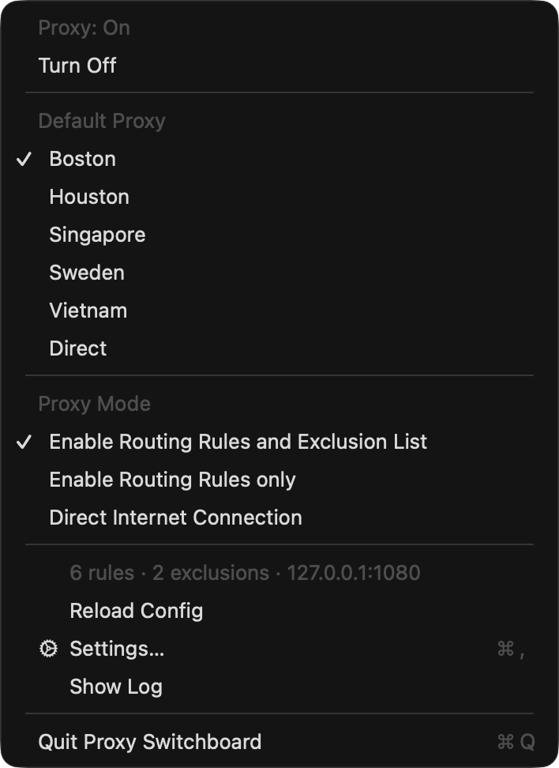
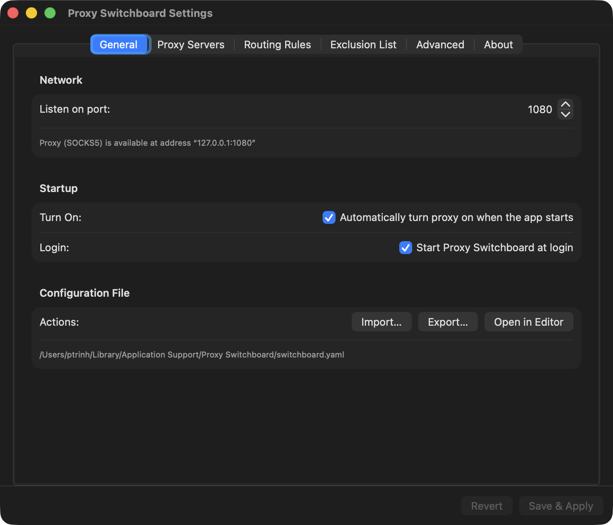
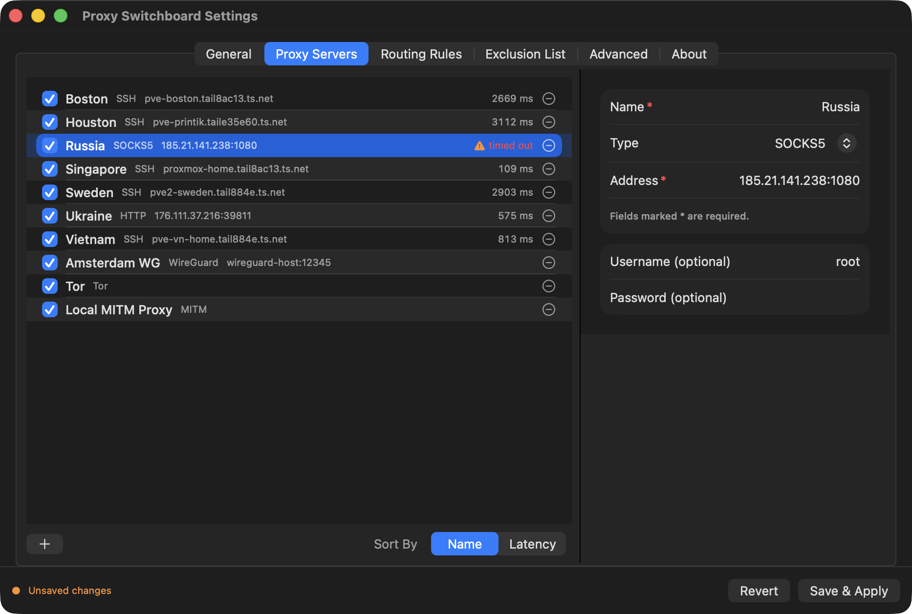
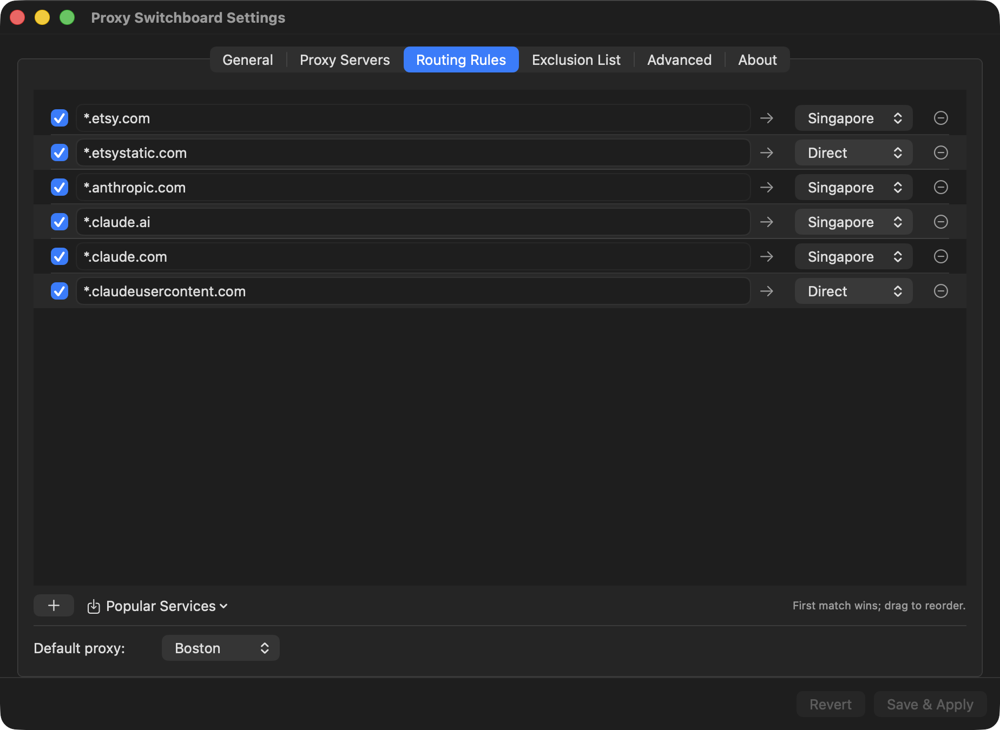
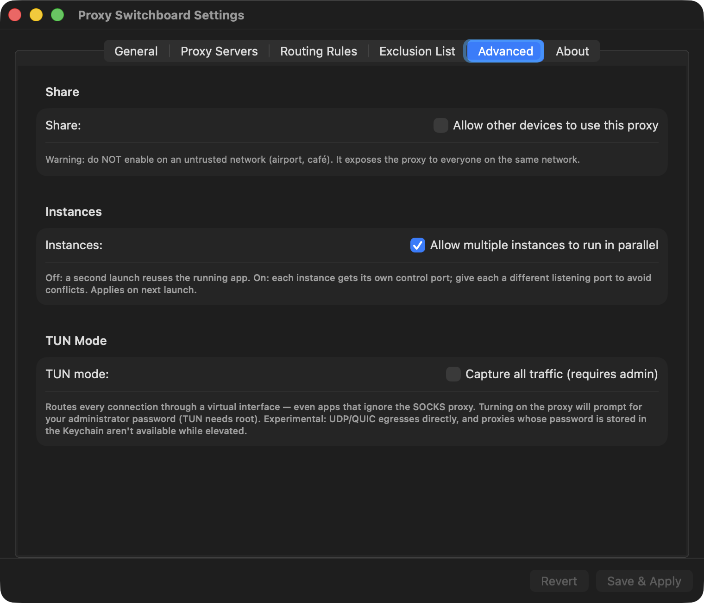

# Proxy Switchboard

A lightweight menu-bar/system-tray app for **macOS, Windows, and Linux** that
routes your traffic **per destination**.
Send some sites through an SSH tunnel, others through a SOCKS/WireGuard/Tor
proxy, block trackers, and keep everything else direct — all chosen by simple
hostname or CIDR rules, switchable from the menu bar.

It runs a local SOCKS5 proxy, points the macOS system proxy at it, and decides
where each connection goes based on your rules.

> This repository is the **public download + auto-update channel**. The app
> source is private.

## Features

- **Per-destination routing** by hostname (`*.example.com`), exact host, or CIDR.
- **Many upstream types:** direct, HTTP/HTTPS, SOCKS5, SSH tunnel, Shadowsocks,
  WireGuard (userspace — no admin needed), Tor, a blocking sink, and a MITM
  HTTP(S) debugger.
- **Exclusion list** of hosts/CIDRs that always connect directly.
- **Switchable default proxy and routing mode** from the menu bar.
- **Proxy groups** — round-robin or least-latency with automatic failover.
- **Live stats** — per-proxy and per-destination bandwidth with a throughput graph.
- **Popular Services presets** — one-click rules for Anthropic, OpenAI, Google,
  social, streaming, trackers/ads, and more.
- **Latency testing** per proxy, **per-proxy enable/disable**, import/export.
- **Localized** — English, 简体中文, 繁體中文, Tiếng Việt (and more).
- **Secure:** passwords and keys are stored in the macOS Keychain, never in the
  config file. SSH uses your existing `~/.ssh` keys and `ssh-agent`.
- **Share to LAN** (optional) so other devices can use the proxy.

## Screenshots

| | |
|---|---|
|  |  |
| **Menu bar** — turn on/off, switch the default proxy and routing mode. | **General** — listening port, language, and startup options. |
|  |  |
| **Proxy Servers** — add/edit proxies and test latency. | **Routing Rules** — per-destination rules with the Popular Services importer. |
|  | |
| **Advanced** — proxy groups, Share to LAN, multiple instances, TUN mode. | |

## Install

### macOS

Requires macOS 13 (Ventura) or later, Apple Silicon or Intel.

**Homebrew:**

```sh
brew install --cask ptrinh/tap/proxy-switchboard
```

**Direct download:** grab the latest `Proxy-Switchboard-<version>.zip` from
[Releases](https://github.com/ptrinh/proxy-switchboard-dist/releases), unzip, and
move it to `/Applications`. The app updates itself automatically thereafter
(via Sparkle).

The app is signed with a Developer ID **and notarized by Apple** (since 1.2.0),
so it launches without Gatekeeper warnings.

### Windows

1. Download `ProxySwitchboard-win-amd64.zip` from
   [Releases](https://github.com/ptrinh/proxy-switchboard-dist/releases).
2. Extract it to a folder of your choice (e.g. `C:\Proxy Switchboard`).
   Keep `switchboard-tray.exe` and `switchboard.exe` **in the same folder** —
   the tray launches the engine sitting next to it.
3. Run `switchboard-tray.exe` — an icon appears in the system tray.
   The binaries are not code-signed yet, so SmartScreen may warn on first run:
   click **More info → Run anyway**.
4. Right-click the tray icon → **Settings…** to add proxies and rules, then
   **Turn On**. Enable **Start at login** in Settings to run it automatically.

Updates: **Check for Updates** in the tray menu shows new versions and opens
the download; quit the app before replacing the two `.exe` files.

### Linux

1. Download `ProxySwitchboard-linux-amd64.zip` (or `-arm64`) from
   [Releases](https://github.com/ptrinh/proxy-switchboard-dist/releases).
2. Extract, make the binaries executable, and run the tray:

   ```sh
   unzip ProxySwitchboard-linux-amd64.zip -d ~/proxy-switchboard
   cd ~/proxy-switchboard && chmod +x switchboard switchboard-tray
   ./switchboard-tray
   ```

3. The tray icon uses the StatusNotifier/AppIndicator protocol — KDE, XFCE and
   most desktops support it out of the box; on GNOME install the
   [AppIndicator extension](https://extensions.gnome.org/extension/615/appindicator-support/).
4. Right-click the tray icon → **Settings…** (opens in your browser), add
   proxies and rules, then **Turn On**.

Headless (servers / no tray): run the engine directly with
`./switchboard -config switchboard.yaml`.

## Quick start

1. Launch the app — a globe icon appears in the menu bar.
2. Open **Settings → Proxy Servers** and add a proxy (e.g. an SSH tunnel:
   set the type to SSH, enter `user@host`; leave the key blank to use your
   system SSH keys).
3. In **Routing Rules**, add a rule (or use **Popular Services ▾**) and point it
   at your proxy. Set the **Default proxy** for everything else (usually
   `Direct`).
4. Click **Save & Apply**, then **Turn On** from the menu bar.

The menu bar shows the current state (On / Connecting / Retrying) and lets you
switch the default proxy and routing mode at any time. **Turn Off** or **Quit**
restores your normal connection.

## Settings

- **General** — listening port; UI language; auto-start the proxy when the app
  launches; start at login; open the raw config file.
- **Proxy Servers** — add/edit/remove proxies, test latency, sort by name or
  latency, right-click to copy a server's address.
- **Routing Rules** — ordered `match → proxy` rules (first match wins; drag to
  reorder), the **Popular Services** importer, and the **default proxy** for
  unmatched traffic.
- **Exclusion List** — hosts/CIDRs that always connect directly.
- **Advanced** — proxy groups (round-robin / least-latency), Share to LAN (with
  optional username/password), allow multiple app instances, and experimental
  TUN mode.
- **About** — version, license, and support. Buy a license, enter a key, or
  remove the license from this Mac to move it to another.

### Routing modes (menu bar)

| Mode | Behavior |
|---|---|
| Enable Routing Rules and Exclusion List | Normal: exclusions → rules → default |
| Enable Routing Rules only | Ignore the exclusion list |
| Direct Internet Connection | Send everything direct |

## Proxy types

| Type | Notes |
|---|---|
| `direct` | No proxy. |
| `http` / `https` | HTTP CONNECT proxy; optional username/password. |
| `socks5` | SOCKS5 proxy; optional username/password. |
| `ssh` | SSH tunnel. Uses `~/.ssh` keys + `ssh-agent` by default; trusts new hosts on first use (`known_hosts`). Port defaults to 22. |
| `shadowsocks` | AEAD ciphers: `aes-128-gcm`, `aes-256-gcm`, `chacha20-ietf-poly1305`. |
| `wireguard` | Userspace WireGuard (no admin). Needs the peer endpoint, your private key, the peer public key, and your tunnel address. |
| `tor` | SOCKS5 to a local Tor instance (defaults to `127.0.0.1:9050`). |
| `block` | Drops matching traffic — good for ads/trackers. |
| `mitm` | Decrypts and logs HTTP(S) for debugging (see below). |

### MITM debugging

The MITM proxy decrypts HTTPS so you can log requests/responses. For it to
work, the **device must trust the generated CA**. The CA is created on first use
and served at `http://<your-mac-ip>:<port>/` — open that on the target device
(including phones, when **Share** is on) to download and install it. iOS also
requires enabling full trust under *Settings → General → About → Certificate
Trust Settings*.

## Where things are stored

- **Config:** `~/Library/Application Support/Proxy Switchboard/switchboard.yaml`
- **Log:** `~/Library/Logs/Proxy Switchboard.log` (menu → **Show Log**)
- **Passwords/keys:** macOS Keychain (service "Proxy Switchboard")

You normally edit everything from the Settings window, but the YAML can be
edited directly (menu → Settings → General → **Open**) and reloaded.

## Notes & limitations

- **Coverage:** the system-proxy mode only catches apps that honor the macOS
  proxy. For command-line tools that ignore it (e.g. some CLIs), set
  `ALL_PROXY=socks5h://127.0.0.1:1080`. Apps using QUIC/HTTP-3 (UDP) or raw IPs
  may bypass it. For full capture, use **TUN mode**.
- **TUN mode** (Advanced) captures *all* traffic via a virtual interface, even
  apps that ignore the SOCKS proxy. It needs administrator rights (you're
  prompted when turning the proxy on). Experimental: UDP/QUIC egresses directly,
  and proxies whose password lives in the Keychain aren't available while
  elevated (use SSH key-file proxies or `direct`).
- **Share to LAN** exposes the proxy to your local network; don't enable it on
  untrusted networks (cafés, airports). Set a username/password if you do.

## Pricing & trial

Proxy Switchboard is free to try for **45 days**, fully featured. After that a
license is required to turn the proxy on:

- **Annual** — keeps you on the latest updates.
- **Lifetime** — one-time purchase, updates included.

Buy or enter a key from **Settings → About → Enter License**. You can also
**remove the license from a Mac** there to move it to another machine.

## Support

Questions or issues: **phil@trinh.uk**

© Phil Trinh. All rights reserved.
